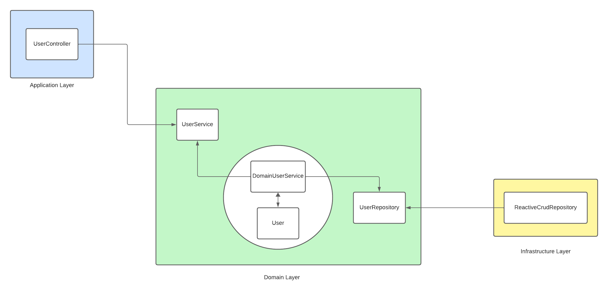

# Users API

### Como ejecutar

El proyecto se debe iniciar ejecutando la siguiente tarea de Gradle desde la raiz del proyecto:

`./gradlew bootRun`

### Esquema Base de Datos
Todos los cambios a la base de datos se pueden encontrar en la carpeta de recursos db.migration:

`src/main/resources/db/migration`

En esta carpeta se pueden encontrar los archivos sql necesarios para construir el esquema de la base de datos

### Como Probar
El API provee un swagger para probar el endpoint:

`http://localhost:8080/webjars/swagger-ui/index.html`

### Configuracion Regex de email y password

Los patrones regex utilizados para verificar email y password pueden ser configurados desde el archivo `application.properties`
encontrado en:

`src/main/resources/application.properties`

### Arquitectura

